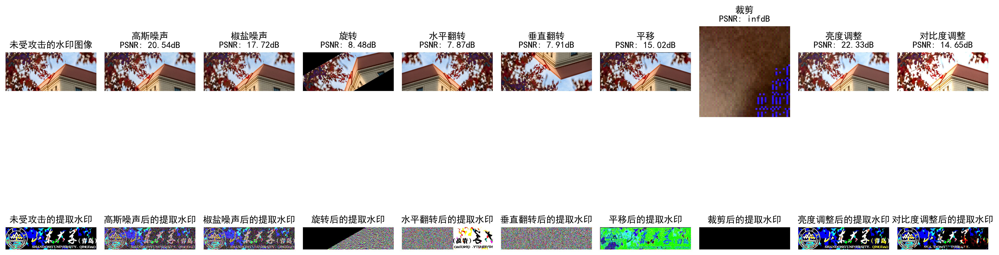

# 实验二  基于DCT的数字图像水印嵌入、提取与鲁棒性测试

## 1. 实验目标

本实验旨在实现一种基于离散余弦变换（DCT）的数字图像水印算法，并实现提取和鲁棒性测试。实验目标包括：
1. 实现基于DCT的数字图像水印嵌入和提取算法
2. 测试水印算法在常见图像处理攻击下的鲁棒性
3. 分析不同攻击对水印提取效果的影响

## 2. 实验内容与实现

本次实验实现了一个完整的基于DCT的数字图像水印系统，包括水印嵌入提取和鲁棒性测试三个主要部分。

### 2.1 数字水印嵌入

水印嵌入是将二值水印图像嵌入到载体图像的DCT域中，具体步骤如下：

#### 1. 预处理
- **加载图像**：将载体图像和水印图像加载到程序中。载体图像是用于嵌入水印的宿主图像，水印图像是需要隐藏的信息。
- **图像格式转换**：将加载的图像从BGR颜色空间转换到RGB颜色空间，以便后续处理。
- **水印二值化**：将水印图像转换为二值图像。通过比较水印图像的每个像素值与平均值，将像素值设置为0或1。这一步骤确保水印信息以二进制形式表示，便于嵌入到载体图像中。

#### 2. DCT分块处理
- **调整图像尺寸**：确保载体图像的尺寸是DCT块大小（8×8）的整数倍。如果不是，则裁剪图像以满足尺寸要求。
- **分离通道**：将载体图像分离成三个颜色通道（红、绿、蓝），以便对每个通道分别进行DCT变换。
- **分块和DCT变换**：将每个通道的图像分割成多个8×8的图像块，并对每个块进行DCT变换。DCT变换将图像从空间域转换到频率域，使得水印信息可以嵌入到高频或低频系数中。

#### 3. 嵌入水印
- **初始化嵌入对象**：为每个颜色通道创建一个`DCT_Embed`对象，用于处理该通道的水印嵌入。
- **DCT分块处理**：对每个通道的图像块进行DCT变换，得到DCT系数块。
- **嵌入水印信息**：在每个DCT块的最后一列中嵌入水印信息。根据水印比特的值（0或1），选择不同的随机序列进行强度调整。具体来说，如果水印比特为1，则使用随机序列`k1`；如果为0，则使用随机序列`k2`。将这些随机序列添加到DCT系数中，以嵌入水印信息。

#### 4. 逆DCT重建
- **逆DCT变换**：对嵌入水印后的DCT系数块进行逆DCT变换，将图像从频率域转换回空间域。
- **重建图像**：将处理后的图像块合并，重建含水印的图像。对每个通道分别进行逆DCT变换和图像重建，然后将三个通道合并成一个完整的彩色图像。

### 2.2 数字水印提取

水印提取是从含水印的图像中恢复水印信息的过程，具体步骤如下：

#### 1. DCT分块处理
- **载入含水印图像**：将含水印的图像加载到程序中，并分离成三个颜色通道。
- **分块和DCT变换**：将每个通道的图像分割成多个8×8的图像块，并对每个块进行DCT变换。

#### 2. 提取水印信息
- **计算相关性**：对于每个DCT块，计算其最后一列与嵌入时使用的随机序列的相关性。根据相关性的大小判断水印比特的值（0或1）。
- **恢复水印**：将每个块的水印比特值组合起来，恢复出完整的水印图像。

### 2.3 鲁棒性测试

为了测试水印算法的鲁棒性，我们模拟了多种常见的图像处理攻击，具体步骤如下：

#### 1. 定义攻击类型
定义了多种常见的图像处理攻击，包括高斯噪声、椒盐噪声、旋转、水平和垂直翻转、平移、裁剪、亮度调整和对比度调整。

#### 2. 施加攻击并提取水印
对嵌入水印后的图像施加每种攻击，并提取水印信息。计算提取水印与原始水印的相关性，评估水印提取的效果。

## 3. 实验结果与分析

### 3.1 原始图像与水印嵌入结果

在实验中，使用一幅山东大学青岛校区的建筑物图像作为背景图像，以及山东大学的校徽和名称作为水印图像。水印嵌入过程将校徽和文字信息隐蔽地嵌入到背景图像的DCT域中。嵌入水印后的图像与原始图像在视觉上几乎一致，表明嵌入过程对图像质量的影响微乎其微。提取的水印图像能够清晰地显示出原始水印的特征，验证了嵌入和提取算法的有效性。

### 3.2 攻击后的水印提取结果（鲁棒性测试）
为了评估水印算法的鲁棒性，对嵌入水印后的图像进行了多种常见的图像处理攻击。

以下是各攻击类型及其对水印提取结果的影响：

| 攻击类型  | PSNR (dB) | 提取水印质量描述             |
| ----- | --------- | -------------------- |
| 未受攻击  | ---      | 完整清晰，与原始水印一致。        |
| 高斯噪声  | 20.54     | 效果良好，细节略有模糊。         |
| 椒盐噪声  | 17.72     | 受损明显，部分区域出现噪点，影响可读性。 |
| 旋转    | 8.48      | 效果较差，出现明显变形和失真。      |
| 水平翻转  | 7.87      | 提取完整，但方向相反，需翻转查看。    |
| 垂直翻转  | 7.91      | 提取完整，但方向相反，需翻转查看。    |
| 平移    | 15.02     | 效果良好，平移操作对水印影响较小。    |
| 裁剪    | 无穷大       | 裁剪区域水印信息丢失，未裁剪区域可提取。 |
| 亮度调整  | 22.33     | 效果良好，亮度变化对水印影响较小。    |
| 对比度调整 | 14.65     | 效果一般，对比度变化导致部分细节丢失。  |

总体来看，该DCT域水印算法在抵抗几何变换（翻转、平移）和亮度调整方面表现出较好的鲁棒性，但在面对椒盐噪声、旋转裁剪等攻击时，水印提取效果受到较大影响，表明算法在抗噪声和局部破坏方面有待进一步优化。

## 4. 实验结论与心得

### 4.1 实验结论

1. **鲁棒性验证**：实验结果表明，基于DCT的数字水印算法在面对多种常见图像处理攻击时具有较好的鲁棒性，尤其在几何变换（翻转、平移）和亮度/对比度调整方面表现良好。
2. **性能分析**：水印嵌入和提取过程高效，嵌入强度参数（alpha）对水印鲁棒性和图像质量的平衡起到关键作用。
3. **局限性**：椒盐噪声和大幅度裁剪攻击会导致水印信息严重丢失，这表明算法在抗强噪声和局部破坏方面仍有提升空间。

### 4.2 心得体会

1. **深入理解DCT应用**：通过本次实验，深入理解了DCT变换在图像压缩和水印嵌入中的应用原理，掌握了DCT系数的选择和处理技巧。
2. **掌握优化技巧**：在实现过程中，学习了如何通过随机序列设计和相关性计算提高水印提取的准确性，并理解了不同攻击对水印的影响机制。

## 附录：实验数据与图像

### 附录A：实验数据

实验中使用的背景图像和水印图像如下所示：

- **背景图像**：尺寸为 6048 x 2574 的彩色图像

- **水印图像**：尺寸为 483 x 118 的校徽图像

### 附录B：实验图像

以下是实验过程中生成的图像：

1. **原始图像与水印嵌入结果**

   

2. **攻击后的图像及提取水印结果**

   

